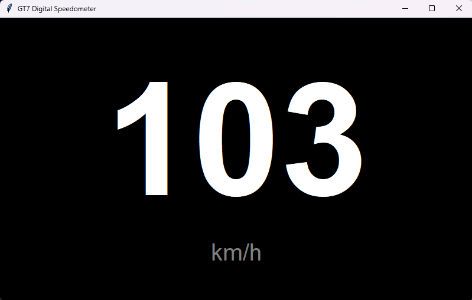

# GT7 UDP telemetry digital speedometer

Gran Turismo 7 のテレメトリUDPを受信して、速度（km/h）を大きく表示するシンプルなデジタルメーターです。

## 特徴

- GT7 のUDPテレメトリを受信
- 速度を km/h で表示
- ダブルクリックでフルスクリーン切替
- `.env` で PS4/PS5 のIPアドレスを管理（Gitに秘匿情報を含めない）

## 必要環境

- Windows (Python 3.8+ 推奨)
- 同一ネットワーク内の PS4/PS5（GT7起動中）

## セットアップ

1. 仮想環境を作成
2. 依存パッケージをインストール
3. `.env` を作成して `PS_IP` を設定

`.env.example` を参考に `.env` を作ってください。

例:

PS_IP=192.168.1.100

## 実行

仮想環境を有効化して、以下を実行します。

- `python gt7_meter.py`

## ファイル構成

- `gt7_meter.py`: メインアプリ
- `.env.example`: 環境変数テンプレート
- `requirements.txt`: 依存パッケージ
- `LICENSE`: MITライセンス

## 注意事項

- UDP通信が一定時間途絶した場合、速度表示は `0` になります。
- GT7側の挙動やネットワーク環境により、受信可否が変わる場合があります。

## ライセンス

- MIT License

## 参考
[Gran Turismo 7 UDP | Library for use on ESP 32 / ESP8266 devices](https://github.com/MacManley/gt7-udp)
